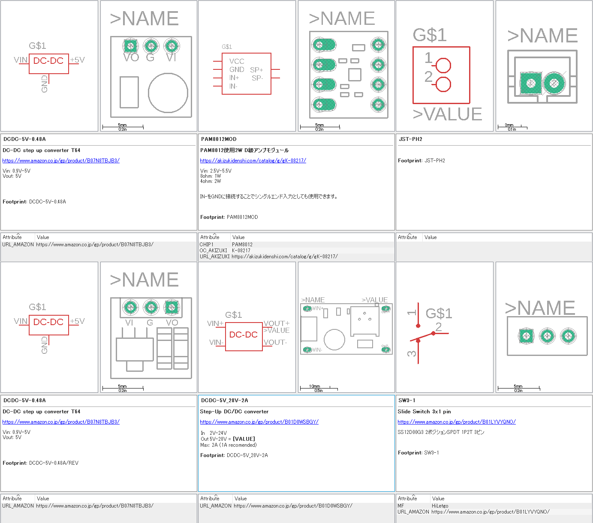

# EagleLib-ytani -- EAGLE Libraries and some examples

既製品のモジュール基板を使う場合など、
Eagleライブラリに部品がなく、
探しても見つからなかったり、
見つかってもどうもしっくりこないものが多く、
歯がゆい思いをしてたので、自分が使いやすいパーツライブラリを作ることにしました。
* Amazonなどのリンク情報も入れました。
* 秋月電子の通販コードも入れました。
* 裏返しで使うことがあるものは、裏のパターンも作りました。
まだまだ、少ないですが、徐々に増やしていきたいと思います。

## INSTALL Library files

### 1. Clone git repository

```bash
$ git clone https://www.github.com/ytani01/EagleLib.git
```
or 
```bash
$ git clone git@github.com:ytani01/EagleLib.git
```

### 2. Copy library files

Source files: ``Libraries/*.lbr``

Distination Folder:
```
C:\Users\{username}\Documents\EAGLE\libraries\EagleLib-ytani
```

## [Libraries](lib/)

* ytani1.lbr

## [examples](example/)

* [Raspberry Pi Zero HAT](example/RPi0-HAT1/)
* [Raspberry Pi Zero Power Module](example/RPi0PWR/)
